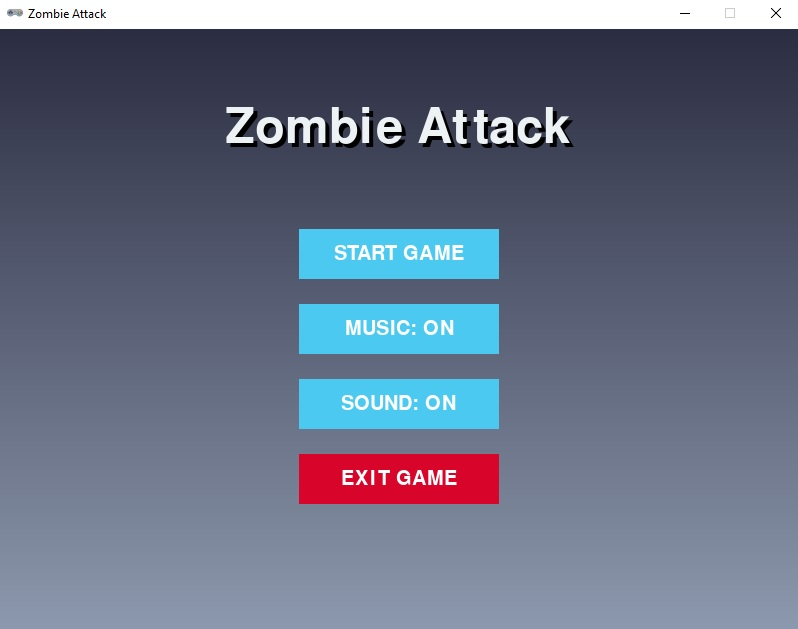
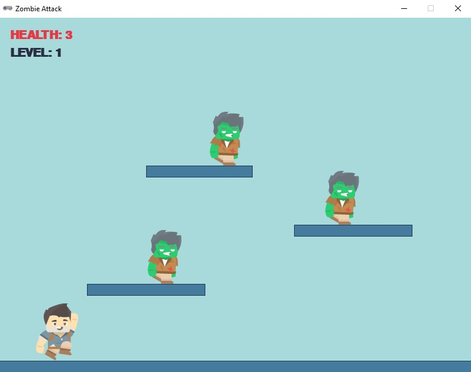

# Zombie Attack #

## Sobre o Jogo ##

"Zombie Attack" é um jogo de plataforma 2D desenvolvido em Python utilizando a biblioteca Pygame Zero . O objetivo do jogador é controlar um herói que deve derrotar inimigos (zumbis) pulando sobre eles enquanto navega por plataformas em dois níveis distintos. O jogo apresenta mecânicas simples, mas divertidas, como: 

    Movimentação : O jogador pode mover o herói para a esquerda, direita e pular.
    Combate : Derrote inimigos pulando sobre eles.
    Progressão : Avance para o próximo nível ao eliminar todos os inimigos no nível atual.
    Interface : A interface exibe a saúde do jogador, o nível atual e mensagens de vitória ou derrota.
     

O jogo também possui um menu principal com opções para iniciar o jogo, ativar/desativar música e som, além de sair do jogo. 

## Requisitos ##
Para rodar o jogo, você precisará dos seguintes requisitos:

1- Python 3.x : Certifique-se de ter o Python instalado

2- Pygame Zero : Instale o Pygame Zero usando o seguinte comando:

    
    pip install pgzero
    
## Como Executar o Jogo  ##

1- Clone ou Baixe o Projeto : Clone este repositório ou baixe os arquivos diretamente.
         

2- Instale as Dependências : Certifique-se de que o Python e o Pygame Zero estão instalados.
         

3- Execute o Jogo : Abra o terminal na pasta do projeto e execute o seguinte comando:
```
pgzrun main.py
```
4- Jogue : 

Use as setas do teclado para mover o herói e a barra de espaço ou a tecla ↑ para pular.
Elimine todos os inimigos pulando sobre eles para avançar para o próximo nível.
     

ScreenShots:



